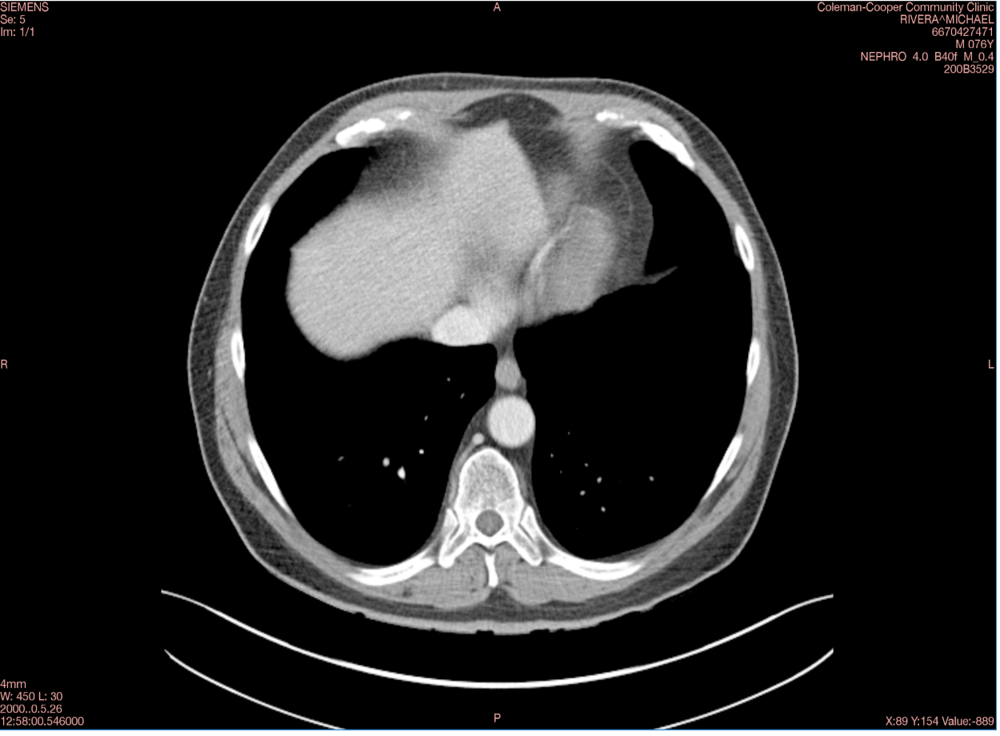
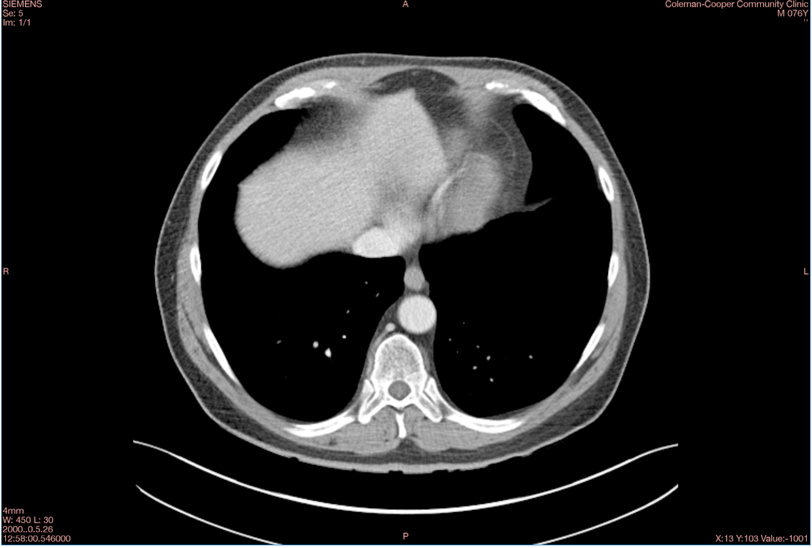

# DICOM De-identification & Burned-in Text Removal

A Python + Flask pipeline that de-identifies medical DICOM files on two fronts at once: **metadata anonymization** (stripping/replacing patient-identifying DICOM tags) and **pixel-level removal of burned-in text** (patient names, IDs, and annotations rendered directly into the image), while preserving diagnostic image quality. Anonymized files can be previewed in the browser in real time via CornerstoneJS before download.

Built as a privacy-engineering project aligned with HIPAA Safe Harbor and NDPR de-identification expectations: the goal is that no protected health information survives in either the header **or** the pixels.

## Before & After




Sample image from a public test dataset; no real patient data.

## Highlights / Features

- Two-stage de-identification: DICOM tag anonymization + burned-in pixel text removal in a single pass.
- Fixed-band masking (configurable top/right strips) combined with scikit-image biharmonic inpainting to erase burned-in text without degrading the surrounding diagnostic image.
- Flask backend (`api_server.py`) handling user auth, DICOM upload, processing orchestration, and serving of anonymized output.
- Session-based login/signup backed by MySQL, with a per-file activity log (upload/view/download).
- Real-time in-browser DICOM preview via cornerstone-core and wado-image-loader — inspect the de-identified result before download.
- Clean separation of concerns: de-identification logic (`dicom_deidentification.py`), text removal (`text_detection.py`), and the API layer (`api_server.py`).

## Project structure (important files)

- `api_server.py` — Flask application: auth (signup/login/session), upload endpoint, processing orchestration, and serving of anonymized DICOMs. Also creates/uses a MySQL database on startup.
- `dicom_deidentification.py` — Core de-identification logic: blanks a fixed list of PHI tags, strips private tags, and remaps UIDs. Pixel data is left untouched at this stage.
- `text_detection.py` — Burned-in text removal: masks fixed rectangular bands of the image and inpaints them with scikit-image.
- `templates/` — HTML templates for login, signup, and the upload/preview UI.
- `static/` — Frontend assets, including the CornerstoneJS viewer integration.
- `uploads/` — Runtime staging directory for incoming DICOM files (should be git-ignored; created at runtime).
- `processed/` — Runtime output directory for anonymized DICOMs (should be git-ignored; created at runtime).
- `requirements.txt` — Python dependencies.

## Getting started (local dev)

1. Create and activate a virtual environment

```
python -m venv venv
source venv/bin/activate   # Windows: venv\Scripts\activate
```

2. Install dependencies

```
pip install -r requirements.txt
```

3. Provide a MySQL database. `api_server.py` connects on startup via PyMySQL and auto-creates its `users` and `file_activity_log` tables. Configure it with environment variables (defaults shown):

```
DB_HOST=localhost
DB_USER=flask_user
DB_PASSWORD=<your password>
DB_NAME=dicom_users
FLASK_SECRET_KEY=<your secret>
```

The server will fail to start if it cannot reach this database.

4. Run the server

```
python api_server.py
```

This starts Flask with `debug=True` on port **8000** — open `http://localhost:8000` in your browser.

5. Sign up for an account, log in, then upload a `.dcm` file (only `.dcm` extensions are accepted) and preview/download the anonymized result.

## How it works (implementation notes)

- **Tag anonymization:** `dicom_deidentification.py` removes all private tags and blanks a fixed list of identifying attributes if present — `PatientName`, `PatientID`, `PatientBirthDate`, `PatientSex`, `OtherPatientIDs`, `OtherPatientNames`, `PatientAddress`, `PatientTelephoneNumbers`, `IssuerOfPatientID`, `PatientMotherBirthName`, `PatientBirthTime`, `PatientWeight`, `ReferringPhysicianName`, `InstitutionName`, `InstitutionAddress`, `AccessionNumber`, `StudyID`, `RequesterName`, `RequestingPhysician`, and `PerformedStationAETitle`. `StudyInstanceUID`, `SeriesInstanceUID`, and `SOPInstanceUID` are replaced with freshly generated UIDs (non-reversible). `PatientIdentityRemoved` is set to `YES` and `DeidentificationMethod` is recorded. This is a curated tag list, not a full implementation of the DICOM PS3.15 Basic Application Level Confidentiality Profile — some attributes in that profile are not covered. Pixel data is not touched in this stage.
- **Burned-in text removal:** this stage does **not** perform computer-vision text detection. `text_detection.py` masks fixed rectangular bands of the display image — by default the top 18% and right 22%, configurable via `strip_pct` — on the assumption that burned-in text/annotations live in those regions, then fills the masked area using scikit-image's `inpaint_biharmonic` on the original pixel data. OpenCV and pytesseract are listed in `requirements.txt` but are not currently used by this pipeline (no thresholding, morphological operations, ROI detection, or OCR occurs). Only `PixelData`, `Rows`, and `Columns` are modified; tags are untouched. Because the masked regions are fixed by position rather than detected by content, this approach only removes text that falls inside the configured bands.
- **Preview before trust:** the processed file is loaded into a CornerstoneJS viewer (cornerstone-core + wado-image-loader) directly in the browser, so the result can be visually verified before it leaves the tool.
- **Why both stages matter:** header-only anonymizers leave PHI visible in the image itself; image-only approaches leave it in the metadata. De-identification is only real when both are handled.

## Privacy note

This tool is a de-identification aid, not a compliance guarantee. Because burned-in text removal relies on fixed image bands rather than content-aware detection, text outside those bands will **not** be removed. Always visually verify output and validate against your organization's HIPAA / NDPR requirements before releasing de-identified data.

## Roadmap

- OpenCV/pytesseract-based text *detection* (the dependencies are already present but unused) to replace fixed-band masking with content-aware localization.
- OCR-based validation pass to confirm zero residual text post-masking.
- Batch-mode processing for directory-level de-identification.
- Configurable tag-anonymization profiles, ideally aligned to the full PS3.15 Basic Profile.

## License

This project is provided as-is.
